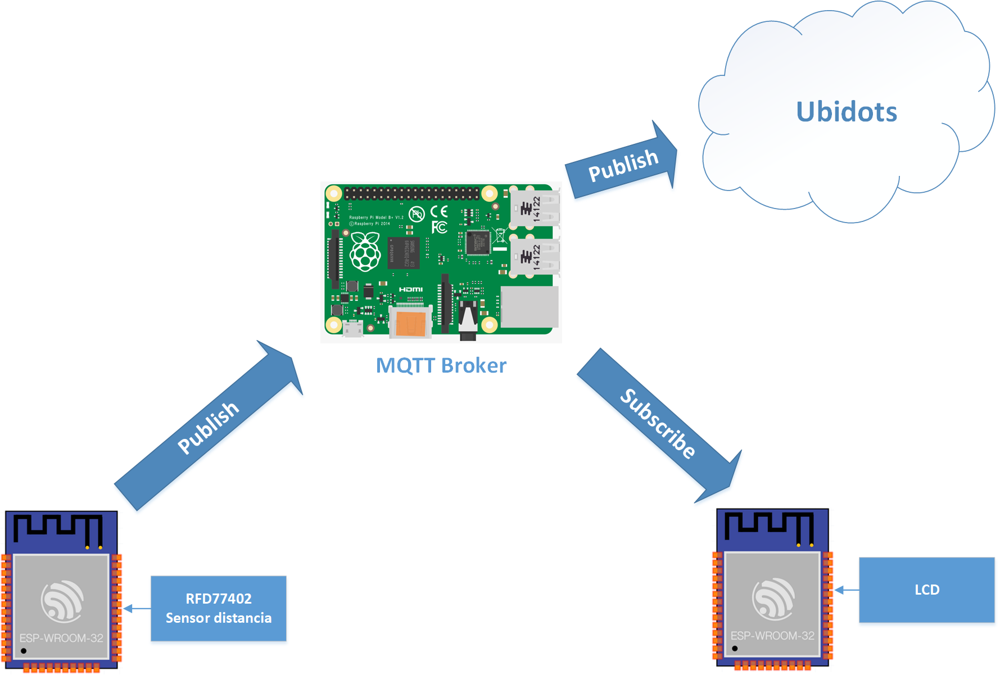
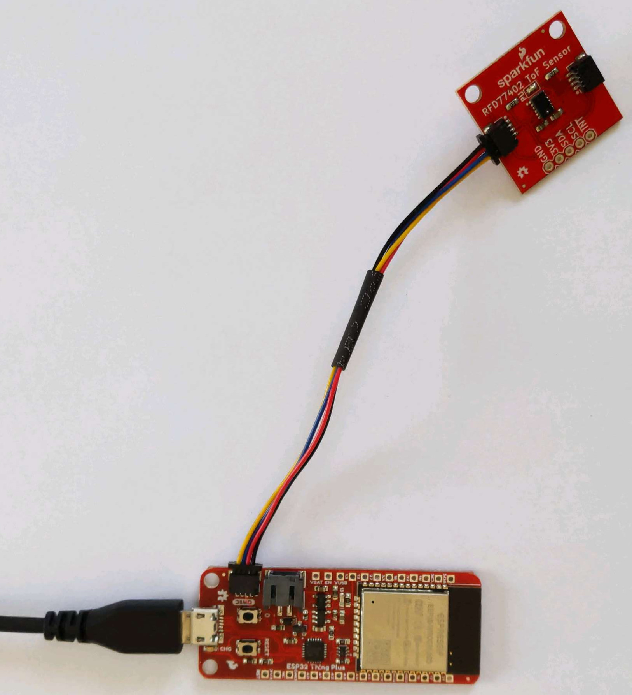
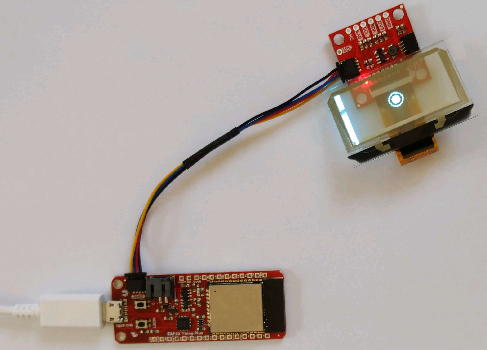
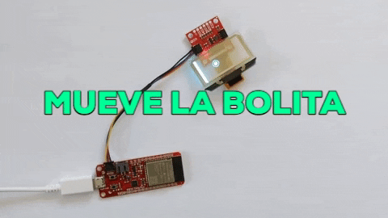

## Taller demostrativo de uso de MQTT con el ESP32



El objetivo de este taller es demostrar el uso del protocolo de red [MQTT](https://mqtt.org/) para conectar el flujo de información entre dispositivos IoT basados en el microcontrolador [ESP32](https://www.espressif.com/en/products/socs/esp32). La imagen arriba muestra la arquitectura de comunicación objetivo a la que se deberá llegar al final del taller.

### Paso 1: Sensor de distancia

Usar el módulo [ESP32 WROOM](https://www.sparkfun.com/products/15663) y el sensor de distancia [RFD77402](https://www.sparkfun.com/products/retired/14539) para crear un dispositivo que mida la distancia a un objeto con precisión milimétrica. Conectar los módulos como se muestra en la imagen:



Conectar el ESP32 a la computadora y usando el [Arduino IDE](https://www.arduino.cc/en/main/software) cargar el siguiente programa en el dispositivo:
```c++
#include <SparkFun_RFD77402_Arduino_Library.h>

//Objeto de librería sensor
RFD77402 myDistance;

void setup()
{
  Serial.begin(115200);
  while (!Serial);
  Serial.println("Ejemplo uso RFD77402");

  //Inicializa el sensor
  if (myDistance.begin() == false)
  {
    Serial.println("Error al inicializar el sensor. Revisar cables.");
    while (1); //Freeze!
  }
  Serial.println("Sensor online!");
}

void loop()
{
  //Efectua una medición
  myDistance.takeMeasurement();
  //Obtiene la medición
  unsigned int distance = myDistance.getDistance();
  //Muestre en puerto serial
  Serial.println(distance);
  delay(50);
}
```
Versión en repositorio: [esp32_distancia.ino](https://raw.githubusercontent.com/fexadom/esp32-mqtt/main/esp32_distancia.ino)

Este programa realiza una medición de distancia cada 50 milisegundos, enviando el resultado por el puerto serial. Usar *Serial Monitor* y *Serial Plotter* en el Arduino IDE para revisar las mediciones.

* Para conectar el ESP32 WROOM a su computadora revisar: [ESP32 Thing Plus Hookup Guide](https://learn.sparkfun.com/tutorials/esp32-thing-plus-hookup-guide)
* Para usar las librerías del RFD77402 revisar: [Qwiic Distance Sensor (RFD77402) Hookup Guide](https://learn.sparkfun.com/tutorials/qwiic-distance-sensor-rfd77402-hookup-guide)


### Paso 2: Display de posición
Usar el módulo ESP32 y el [OLED Transparente](https://www.sparkfun.com/products/15173) para mostrar una animación en el dispositivo como se muestra en la imagen:



Conectar el ESP32 a la computadora y usando el IDE de Arduino, cargar el siguiente código:

```c++
#include "HyperDisplay_UG2856KLBAG01.h"

#define WIRE_PORT Wire

//Distancia máxima
#define MAXDIST 2047

UG2856KLBAG01_I2C myTOLED;

//Posición y radio bolita
uint8_t x;
uint8_t y;
uint8_t r;

int dist;

void posicionarBolita(int distancia)
{
  int x_new = map(distancia, 0, MAXDIST, r+6, myTOLED.xExt);
  if(x_new != x){
    myTOLED.circleClear(x, y, r);
    myTOLED.circleClear(x, y, r-4, true);

    x = (uint8_t) x_new;

     myTOLED.circleSet(x, y, r);
     myTOLED.circleSet(x, y, r-4, true);
  }
}

void setup() {
  Serial.begin(115200);
  while (!Serial);
  Serial.println("Ejemplo bolita movible");

  //Inicializa el OLED en I2C a 400kHz
  WIRE_PORT.begin();
  myTOLED.begin(WIRE_PORT, false, SSD1309_ARD_UNUSED_PIN);
  Wire.setClock(400000);

  //Dibuja la Pared
  myTOLED.rectangleSet(0, 0, 5, myTOLED.yExt, true);

  r=8;
  x=r+6;
  y=myTOLED.yExt/2;
  

  myTOLED.circleSet(x, y, r);             // Dibuja círculo centrado en (x0, y0) con radio r
  myTOLED.circleSet(x, y, r-4, true);     // Dibuja círculo lleno

  dist = 0;
}

void loop() {
  char c;
  if(Serial.available()>0)
  {
    c = Serial.read();
    switch(c)
    {
      case 'a':
        dist -= 50;
        if(dist < 0) dist = 0;
        posicionarBolita(dist);
        break;
      case 'd':
        dist += 50;
        if(dist > MAXDIST) dist = MAXDIST;
        posicionarBolita(dist);
        break;
      default:
        break;
    }    
  }
}
```
Versión en repositorio: [esp32_display.ino](https://raw.githubusercontent.com/fexadom/esp32-mqtt/main/esp32_display.ino)

Este programa permite mover la bolita en el OLED usando el puerto serial. Desde el *Serial Monitor* del IDE de Arduino se puede enviar caracteres por el puerto serial al dispositivo. Para alejar la bolita de la pared enviar la letra 'd' y para acercar a la pared enviar la letra 'a'.



* Para usar las librerías del OLED Transparente: [Transparent Graphical OLED Breakout Hookup Guide](https://learn.sparkfun.com/tutorials/transparent-graphical-oled-breakout-hookup-guide)

### Paso 3: Configurar broker MQTT
En este paso es necesario configurar al Raspberry Pi como broker MQTT para que sirva de intermediario entre varios dispositivos IoT. Durante el taller se proporcionará a cada estudiante las credenciales para acceder a los Raspberry Pi:
* IP del dispositivo
* Usuario y clave

Usar un cliente SSH como [Putty](https://www.putty.org/) para conectarse a la consola del Raspberry Pi e instalar [Mosquitto](https://mosquitto.org/) un broker MQTT código abierto de la siguiente forma:
```bash
# Instala mosquitto MQTT
sudo apt install mosquitto mosquitto-clients
# Registra a mosquitto como servicio
sudo systemctl enable mosquitto.service
```
Verificar la instalación correcta con:
```bash
mosquitto -v
```
Una vez instalado es posible subscribirse y publicar a topicos a traves del broker usando la IP y el puerto 1883.

### Paso 4: Publicar y Subscribirse a un tópico MQTT desde el ESP32
El siguiente código permite que el ESP32 se subscriba al tópico *esp32/data* y publique, al mismo tópico, lo que lee en el puerto serial:
```c++
#include <WiFi.h>
#include <PubSubClient.h>

#define WIFISSID "<WIFI SSID>"
#define PASSWORD "<Clave WiFi>"
#define TOPIC "esp32/data"

char mqttBroker[]  = "<IP MQTT BROKER>";
char payload[100];

WiFiClient esp32client;
PubSubClient client(esp32client);

void setup_wifi() {
  // Conectarse al WiFi
  Serial.println();
  Serial.print("Conectando a ");
  Serial.println(WIFISSID);

  WiFi.begin(WIFISSID, PASSWORD);

  while (WiFi.status() != WL_CONNECTED) {
    delay(500);
    Serial.print(".");
  }

  Serial.println("");
  Serial.println("WiFi conectado");
  Serial.println("IP: ");
  Serial.println(WiFi.localIP());
}


void callback(char* topic, byte* payload, unsigned int length) {
  char p[length + 1];
  memcpy(p, payload, length);
  p[length] = NULL;
  String message(p);
  Serial.println(message);
}

void reconnect() {
  // Intentar hasta conectarse
  while (!client.connected()) {
    Serial.print("Conectandose al broker MQTT...");
    // Intento de conección
    if (client.connect("ESP32Client")) {
      Serial.println("conectado");
      // Subscripción
      client.subscribe(TOPIC);
    } else {
      Serial.print("error, rc=");
      Serial.print(client.state());
      Serial.println(" intentar en 5 segundos...");
      // Esperar 5 segundos
      delay(5000);
    }
  }
}

void setup() {
  Serial.begin(115200);

  Serial.println("Test MQTT");

  setup_wifi();
  client.setServer(mqttBroker, 1883);
  client.setCallback(callback);
}

void loop() {
  if (!client.connected()) {
    reconnect();
  }
  client.loop();
  
  char serial_byte;
  if(Serial.available()>0)
  {
    //Leer el puerto serial
    serial_byte = Serial.read();
    if(isalnum(serial_byte)){
      //Publicar el byte leido
      sprintf(payload, "%c", serial_byte);
      client.publish(TOPIC, payload);
    }
  }
}
```
Versión en repositorio: [esp32_mqtt.ino](https://raw.githubusercontent.com/fexadom/esp32-mqtt/main/esp32_mqtt.ino)

Usar el cliente MQTT en el Raspberry Pi para suscribirse y mostrar los mensajes que envia el ESP32:
```bash
mosquitto_sub -d -t esp32/data
```
y usar un cliente MQTT para publicar mensajes al ESP32:
```bash
mosquitto_pub -d -t esp32/data -m "Hola!"
```

### RETO 1: Publicar datos del sensor de distancia 
Usando los ejemplos proporcionados en los pasos 1 a 4:
* Configurar un ESP32 para que publique las mediciones de distancia al tópico *esp32/data*
* Suscribir un ESP32 al tópico *esp32/data* y reflejar los datos recibidos en la posición de la bolita...
* **OPCIONAL:** Instalar el App [MQTT Dashboard](https://play.google.com/store/apps/details?id=com.app.vetru.mqttdashboard&hl=en_US&gl=US) en un Smartphone y controlar/visualizar los datos en ambos ESP32...

### RETO 2: Publicar datos a Ubidots usando Node-RED
[Ubidots](https://ubidots.com/) es una plataforma para visualizar y distribuir datos de sistemas IoT en la nube. Usando el framework [Node-RED](https://nodered.org/) en el Raspberry se puede procesar y enviar los datos a Ubidots para visualizarlos en línea.
* [Instalar Node-Red en el Raspberry Pi](https://nodered.org/docs/getting-started/raspberrypi)
* Crear una cuenta en Ubidots, obtener el TOKEN de API para poder recibir requerimiento REST y mensajes MQTT
* Crear un *flow* en Node-RED para conectar el Raspberry Pi con Ubidots: [ver ejemplo](https://help.ubidots.com/en/articles/1440402-connect-node-red-with-ubidots)
* El procesamiento de datos podría ser un simple [promedio móvil](https://flows.nodered.org/node/node-red-contrib-moving-average) de los datos de distancia previo su envio a Ubidots
